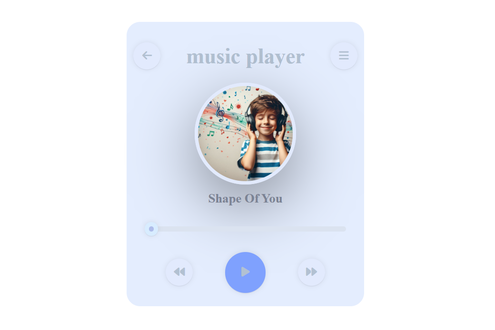

# Music Player 🎵

A simple and interactive web-based music player built with HTML, CSS, and JavaScript. This project allows users to play, pause, and scrub through audio tracks with an intuitive interface.

--- 

## Features 🚀

- Play/Pause functionality.

- Real-time progress bar to track the audio's progress.

- Scrubbing feature to jump to specific parts of the audio.

- Responsive UI with Font Awesome icons for play/pause controls.

---

## Demo 📸
Open the Project click [here](https://naveenkumar-developer.github.io/musicPlayer/)

---

## Technologies Used 🛠️

- HTML 5.

- JavaScript for interactivity.

- CSS for styling.

- Font Awesome Icons for play and pause buttons.

--- 

## Notice

- No support for multiple audio files or playlists yet.

---

##  Future Enhancements 💡

- Add volume control and mute functionality.

- Implement a playlist feature.

- Integrate with audio visualizers for a more immersive experience.

- Add more audio files.

